# JDBC-STUDENT-RECORD-SYSTEM :star_struck:

[](https://shields.io/) [](https://shields.io/) [](https://shields.io/) [](https://shields.io/) [](https://shields.io/) [](https://shields.io/)
<br>
***This new Web application is created by Biswarup Bhattacharjee, student of BTECH, in University of Engineering and Management, Kolkata.***

**Email Id: bbiswa471@gmail.com.** 

**Contact No: 916290272740.** 

[](https://www.facebook.com/biswarup.bhattacharjee.5811) [](https://github.com/biswa2210)

## About :point_down: 


## Purpose :point_down:


## Use :point_down:

## Applications and Future Scopes:point_down:


## Folder Structure :point_down:
```bash

     ├── .idea

     └── rootwallpaper.jpg 
```                       

## Making :point_down:


## Screenshots :point_down: 
<div align="center">
<a href="jdbc1.PNG">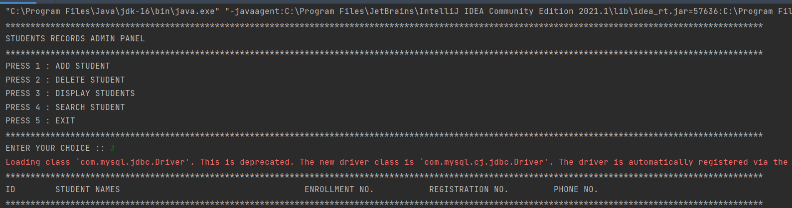</a> <a href="jdbc2.PNG">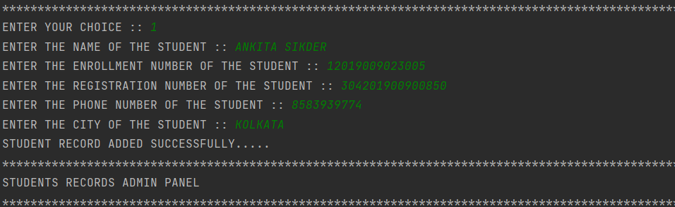</a>

<a href="jdbc3.PNG">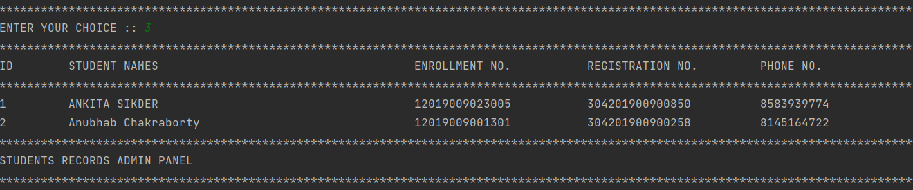</a> <a href="jdbc4.PNG">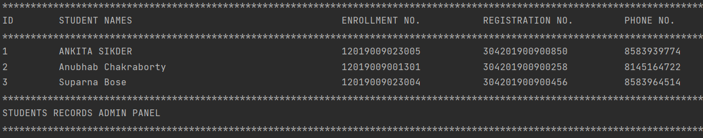</a>

<a href="jdbc5.PNG">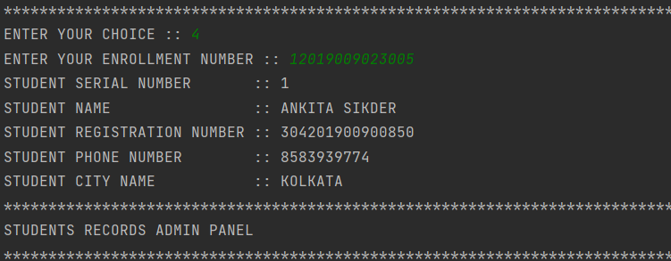</a> <a href="jdbc6.PNG">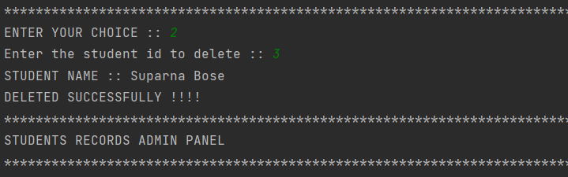</a>

<a href="jdbc7.PNG">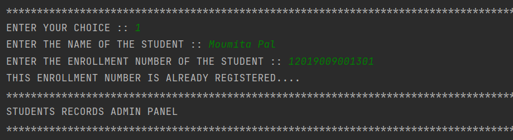</a> <a href="jdbc8.PNG">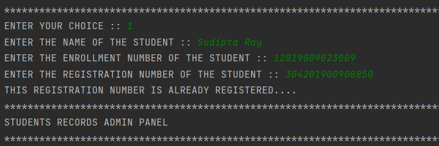</a>

<a href="jdbc9.PNG">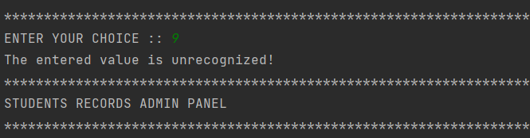</a> <a href="jdbc10.PNG">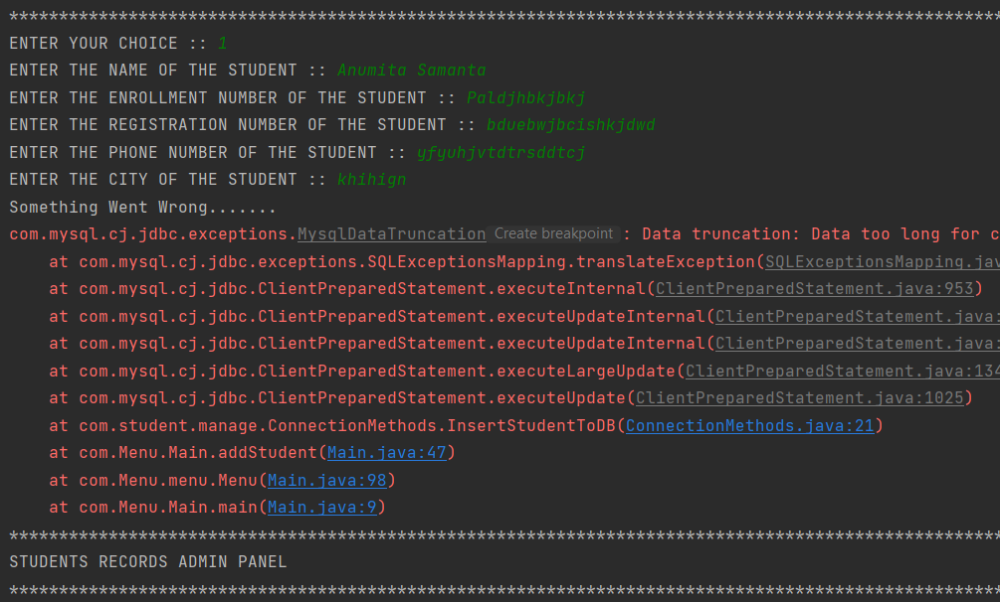</a>


<a href="sql1.PNG">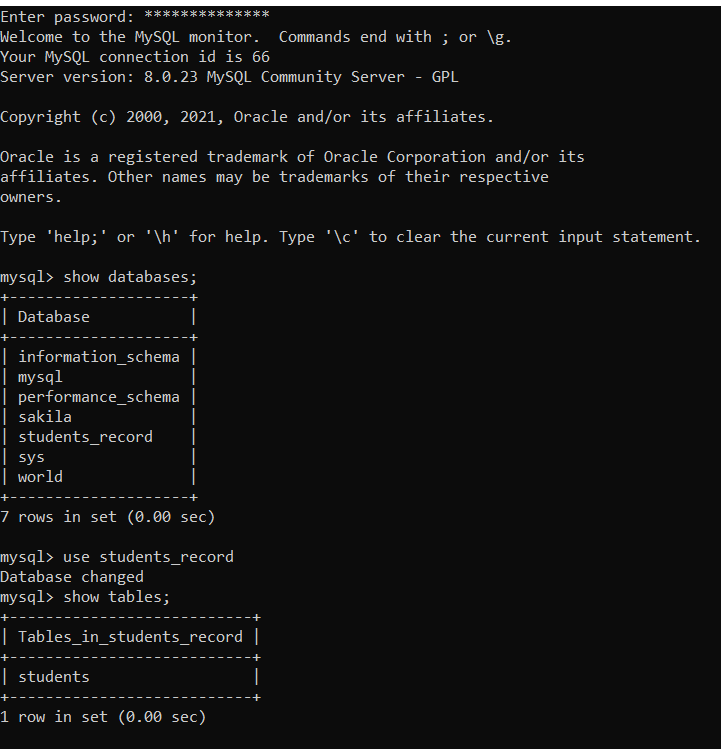</a> <a href="sql2.PNG">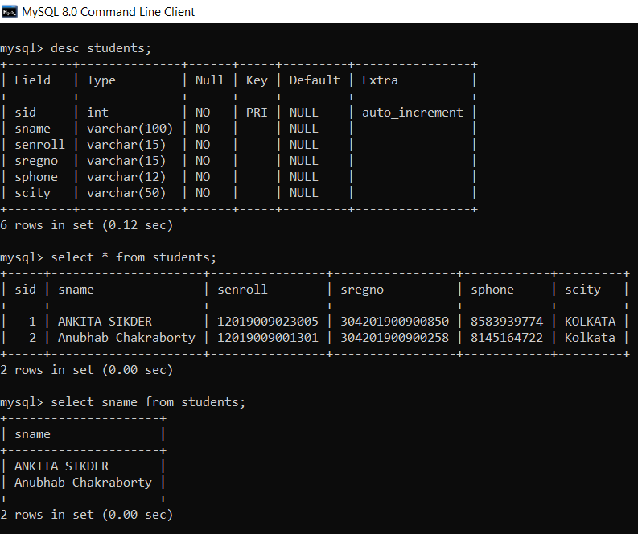</a>
</div>


